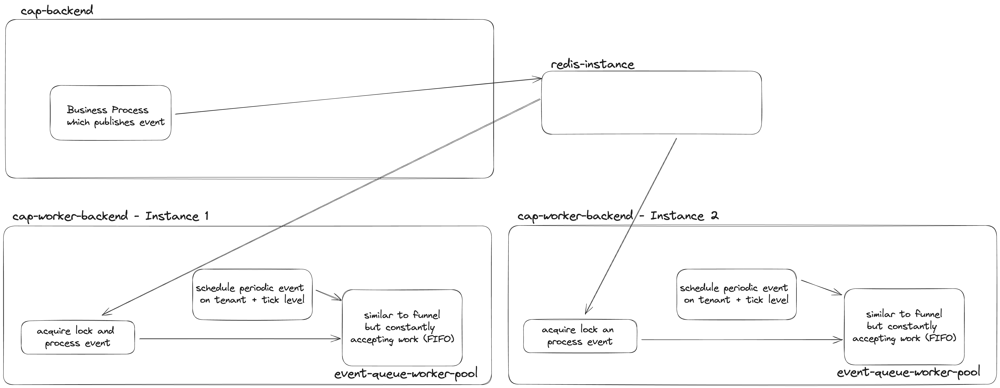

<!-- prettier-ignore-start -->
# Load Balancing
{: .no_toc}
<!-- prettier-ignore-end -->

<!-- prettier-ignore -->
- TOC
{: toc}

Load balancing is a critical feature of the Event-Queue framework, designed to efficiently distribute asynchronous
event processing across multiple application instances. This chapter provides an overview of how Event-Queue employs
load balancing to ensure optimal performance.

## Importance of Load Balancing with Event-Queue

One of the key factors to use Event-Queue is its ability to balance the load of event processing across all available
application instances. Load balancing helps prevent overloading any single instance, thereby avoiding CPU and memory
peaks that could adversely affect the application's performance and stability.

## Control Over Load Distribution

Event-Queue allows for precise control over the load of specific processes. This is achieved by defining the load that
each event can handle, thus ensuring that no single event or process becomes a bottleneck. This load distribution 
strategy not only helps in maintaining a smooth and stable performance but also contributes to the overall robustness 
of the application.

## Application Instance Load Limit

Each application instance has a specific load limit that is not exceeded, ensuring that the application runs optimally
without overloading the resources of any particular instance. This limit is dynamic and can be adjusted based on the
requirements and capabilities of the application.

## Load Transfer Between App Instances

In scenarios where a particular application instance reaches its maximum load, other instances can take over the 
processing of events. This automatic load transfer feature ensures that the application continues to function smoothly
and efficiently, even under high load conditions.

## Event Distribution via Redis

Event-Queue utilizes Redis' publish/subscribe mechanism to distribute events to different application instances. 
This approach allows for effective load balancing and ensures that each instance processes only the events it is 
subscribed to. With Redis' reliable and fast publish/subscribe system, Event-Queue can distribute events quickly and
efficiently, ensuring optimal load balancing across all application instances.

## Configuration parameters

The maximal load of an application instance is defined by the parameter [instanceLoadLimit](/event-queue/setup/#initialization-parameters).
The current load of an application instance is calculated by multiplying the number of running events by the load of
each event. It's important to note that the calculated load is cross-tenant, meaning the available capacity is shared 
across all tenants.

## Explained on example

The picture below shows an example architecture where the event-queue is used. The setup is divided into a backend designated
to purely serve frontend requests and a worker-backend for the async processing to keep the event-loop of the frontend
facing backend responsive at any time.

In this example, business processes originating from a user produce an event in the backend and publish that event
via Redis to the worker-backend for processing. On the worker-backend, all periodic events are also processed. In
this example, both worker-backends can do the processing depending on which instance has the capacity to process the
load.

In conclusion, the load balancing feature of Event-Queue is instrumental in ensuring efficient and effective event 
processing. By controlling the load distribution, limiting the load on individual instances, and transferring the 
load between instances as needed, Event-Queue helps maintain optimal application performance. Coupled with the power
of Redis' publish/subscribe mechanism for event distribution, Event-Queue delivers a robust solution for managing
asynchronous event processing in high-performance applications.