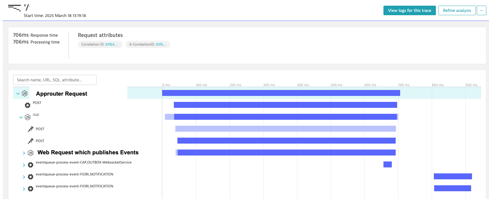

<!-- prettier-ignore-start -->

{: .no_toc}

# Telemetry Insights

<!-- prettier-ignore -->

- TOC
{: toc}

<!-- prettier-ignore-end -->

The `@cap-js-community/event-queue` module comes with built-in support for OpenTelemetry, enabling seamless tracing and
observability of event processing. With this integration, you can track events from publication to execution, ensuring
full visibility into your system’s event flow.

## Key Features

- **Automatic Event Tracing** – Captures OpenTelemetry traces for event execution, helping you analyze processing times
- and dependencies.
- **Trace Context Propagation** – Preserves the OpenTelemetry tracing context when events are published and processed,
- maintaining a clear linkage across distributed systems.
- **End-to-End Monitoring** – Ensures that traceability is maintained from the moment an event is created until it is
- fully processed.

## How It Works

1. **Publishing an Event**

   - When an event is published, the current OpenTelemetry trace context is extracted.
   - If no trace context is present, a new one is automatically created.
   - The trace context is then attached to the event metadata.

2. **Processing an Event**
   - Upon processing, the previously stored trace context is retrieved.
   - If no trace context exists, a new one is generated to ensure traceability.
     - Periodic Events never have a existing trace context
   - The trace context is injected back into the OpenTelemetry framework, maintaining continuity.

## Benefits

- **Comprehensive Observability** – Gain insight into event-driven workflows across different services.
- **Easier Debugging** – Quickly pinpoint performance issues and failure points.
- **Seamless Integration** – Compatible with OpenTelemetry-based monitoring tools with minimal setup.

## Configuration

By default, OpenTelemetry tracing is enabled if an OpenTelemetry exporter is set up or if Dynatrace OneAgent is
configured to export traces. However, the OpenTelemetry API must always be installed in the project.

For more advanced configurations, refer to the OpenTelemetry documentation on context propagation and trace exporters.
This integration also works smoothly with `@cap-js/telemetry`, meaning that if `@cap-js/telemetry` is configured,
trace exporting works out of the box with no additional setup.

## Pitfalls with OpenTelemetry Tracing and Dynatrace OneAgent

When using Dynatrace OneAgent for trace exporting without a separate OpenTelemetry exporter, there are some important
limitations to be aware of:

- **Dependency on Dynatrace Trace Context**  
  Dynatrace OneAgent only exports traces to Dynatrace if they contain a valid Dynatrace trace context. This context is
  automatically created when an event is published within the scope of an HTTP request or another operation captured by
  Dynatrace OneAgent.

- **Issues with Periodic and Standalone Events**  
  Events that are triggered periodically (e.g., scheduled jobs) or published without an existing Dynatrace trace context
  may not be visible in Dynatrace. Since these events lack the necessary Dynatrace trace context, OneAgent does not
  export them unless a separate OpenTelemetry exporter is configured.

### Recommendation

To ensure visibility of all traces—including periodic events or events outside of a Dynatrace-traced request—configure
a dedicated OpenTelemetry exporter alongside Dynatrace OneAgent. This guarantees that traces are properly exported even
when a Dynatrace trace context is missing.

## Example Trace

